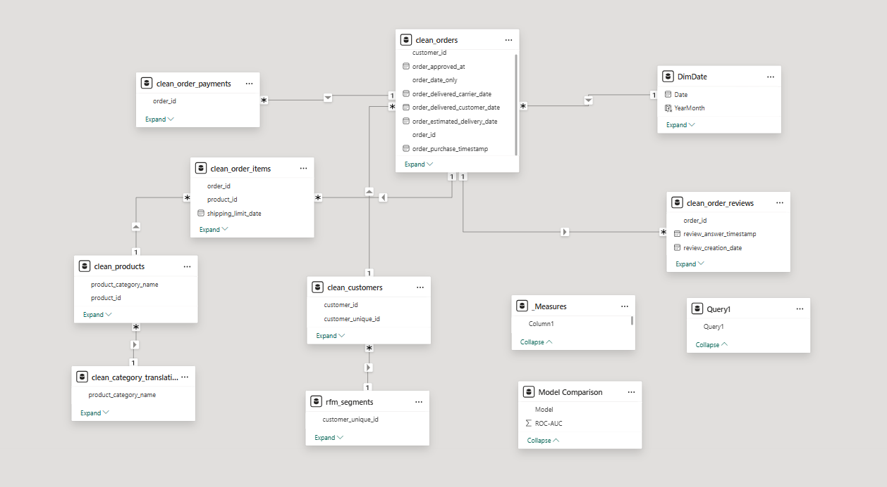
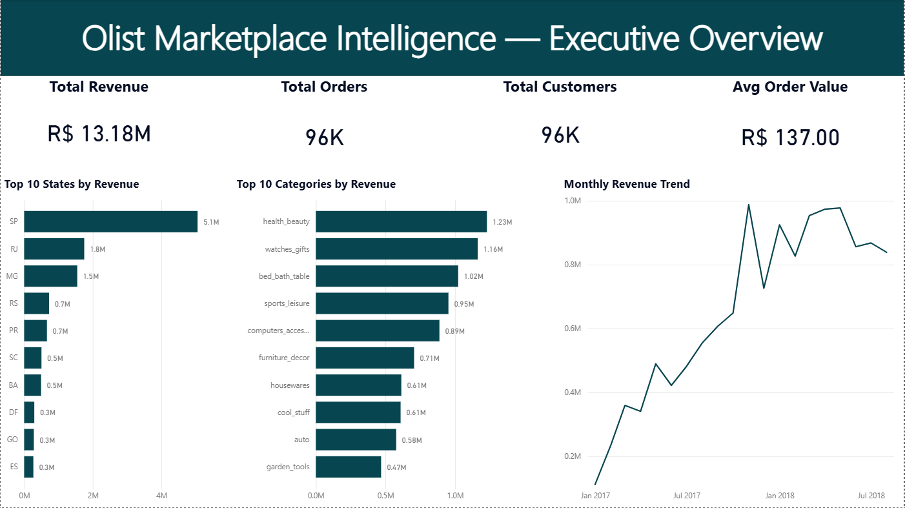
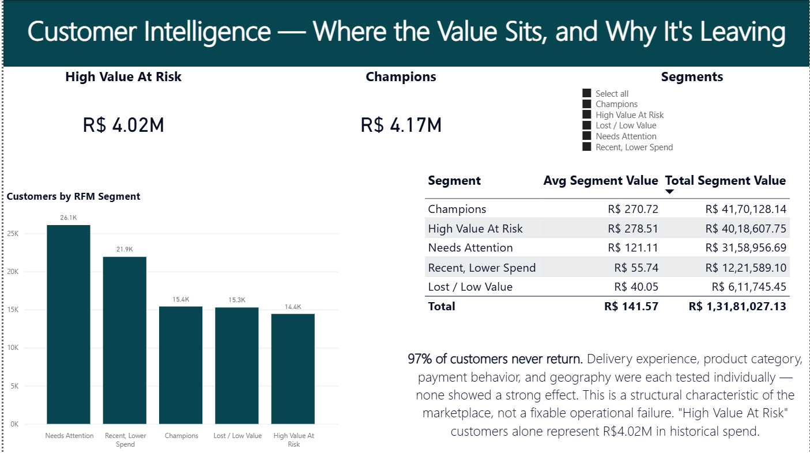
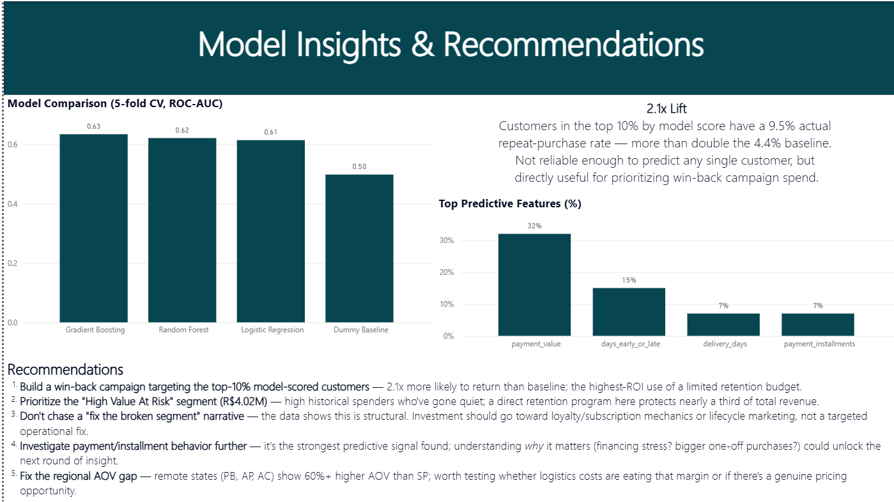

# Olist Marketplace Intelligence Platform

**End-to-end analytics project on the Olist Brazilian E-Commerce dataset — SQL → Python → Power BI — built to answer one question: *why do 97% of customers never come back, and what should the business do about it?***

[Power BI dashboard](#dashboard) · [Data model](#data-model) · [SQL scripts](sql/) · [Python analysis](python/) · [Findings log](docs/data_cleaning_log.md) · [Issues & debugging](docs/issues_and_debugging.md)

## Project Summary

A ~99,000-order, 9-table relational dataset was cleaned, modeled as a star
schema, and analyzed across three layers — SQL for hypothesis testing,
Python for segmentation and predictive modeling, Power BI for executive
reporting. The project's central finding — a 97% one-time-purchase rate
with no single identifiable cause — was reached by systematically testing
and ruling out four competing hypotheses (delivery experience, product
category, payment behavior, geography), then confirmed independently by a
4-model machine learning comparison. The result was reframed from a failed
classification problem into a working, honestly-scoped targeting tool (2.1x
lift over baseline) with five concrete, evidence-linked business
recommendations. Every non-trivial technical problem encountered during
development — locale bugs, relationship modeling errors, cross-validation
methodology mistakes — is documented in [`docs/issues_and_debugging.md`](docs/issues_and_debugging.md)
rather than hidden, since diagnosing and resolving these was as much a part
of the real work as the final numbers.

---

## Business Problem

Olist is a Brazilian e-commerce marketplace connecting small sellers to
customers across the country. This project simulates the work of an analyst
asked to:

1. Quantify current performance (revenue, margin, orders, customers)
2. Segment customers by value and behavior (RFM)
3. **Find the root cause** of a strikingly low repeat-purchase rate — not
   just report it
4. Recommend specific, actionable next steps

**Dataset:** [Olist Brazilian E-Commerce Public Dataset](https://www.kaggle.com/datasets/olistbr/brazilian-ecommerce)
(Kaggle, public, CC BY-NC-SA 4.0) — ~99,000 real orders across 9 relational
tables (customers, orders, order items, payments, reviews, products,
sellers, geolocation, category translations). Raw data is not included in
this repo (available directly from the Kaggle link above); this repo
contains the analysis code and outputs.

## Tools

`SQL (SQLite)` · `Python (pandas, scikit-learn)` · `Power BI` · `Git`

## Pipeline

```
Raw CSVs (9 relational tables, ~99K orders)
        │
        ▼
Python — load into SQLite, index, data-quality checks (02_data_quality_checks.py)
        │
        ▼
SQL — executive KPIs, monthly trend, regional/category performance,
      RFM base table, 4 hypothesis-testing investigations (sql/01-10)
        │
        ▼
Python — RFM segmentation, feature engineering, 4-model comparison,
         churn/repeat-purchase targeting model (python/03-05)
        │
        ▼
Power BI — 3-page executive dashboard (Overview / Customer Intelligence /
           Model Insights & Recommendations)
```

Run it yourself (requires the 9 Olist CSVs from Kaggle in your working directory):
```bash
jupyter notebook python/Customer_Sales_Intelligence_Olist.ipynb
# or open directly in Google Colab
```
The notebook runs top-to-bottom as a single linear pipeline — load & index
→ data quality checks → executive KPIs → trend/regional/category analysis
→ RFM base table → four hypothesis tests → feature engineering → 4-model
comparison → final model + business reframe → RFM segmentation. Every
section has a markdown explanation directly above the code, including one
deliberately-preserved early mistake (`customer_id` vs.
`customer_unique_id`, §2) documenting a real bug caught during development
rather than a silently "clean" final version.

SQL scripts in `sql/` are extracted from the notebook as standalone,
individually runnable files and can be executed directly against
`olist.db` (e.g. via `sqlite3` CLI, DB Browser for SQLite, or
`pd.read_sql()`).

## Key Findings

**1. Revenue grew steadily through 2017** (peaking +52% MoM in Nov 2017,
likely Black Friday), but **growth stalled in 2018** — May 2018 (R$977K) was
the effective peak; Jun–Aug 2018 stayed flat or below it.

**2. Revenue is geographically concentrated: São Paulo alone = 42% of
customers, 38% of revenue** — more than the next 5 states combined. Yet SP
has the *lowest* average order value (R$125), while remote states (PB, AP,
AC) have the *highest* (R$200+) — remote customers order less often but
spend more per order when they do.

**3. Central finding — 97% of customers are one-time buyers.** Four
hypotheses were tested to explain this, each controlling for
reorder-eligibility (first order 6+ months before the data cutoff):

| Hypothesis | Result |
|---|---|
| Delivery experience (speed, on-time %, review score) | No effect |
| Product category (durable vs. consumable) | No clear pattern |
| Payment behavior (installments, order value) | Weak effect |
| Geography (customer state) | Weak effect |

**No single lever explains it — repeat purchase is a structural,
platform-wide characteristic, not a fixable operational issue in any one
area.**

**4. A 4-model comparison (Dummy → Logistic Regression → Random Forest →
Gradient Boosting) confirms this:** best ROC-AUC of 0.634, clearly better
than random (0.498) but not strong enough to reliably classify individual
customers. **Reframed as a targeting tool**, the top 10% of customers by
model score have a **9.5% actual repeat rate vs. a 4.4% baseline — a 2.1x
lift** — genuinely useful for prioritizing a win-back campaign.

**5. RFM segmentation shows R$8.19M (62% of revenue)** sitting in the
"Champions" and "High Value At Risk" segments combined — high-value
customers who are either currently engaged or have already gone quiet.

## Recommendations

| # | Recommendation | Tied to finding |
|---|---|---|
| 1 | Build a win-back campaign targeting the top-10% model-scored customers — 2.1x more likely to return than baseline | #4 |
| 2 | Prioritize the "High Value At Risk" segment (R$4.02M) with a direct retention program | #5 |
| 3 | Don't chase a "fix the broken segment" narrative — invest in loyalty/subscription mechanics or lifecycle marketing instead of a targeted operational fix | #3 |
| 4 | Investigate payment/installment behavior further — the strongest predictive signal found, worth understanding *why* it matters | #3, #4 |
| 5 | Fix the regional AOV gap — remote states show 60%+ higher AOV than SP; worth testing whether logistics costs are eating that margin | #2 |

## Data Model

Star schema built in Power BI: `clean_orders` / `clean_order_items` sit at
the center as fact tables, surrounded by `clean_customers`, `clean_products`
(→ `clean_category_translation`), `clean_order_payments`,
`clean_order_reviews`, `DimDate`, and `rfm_segments` as dimension/lookup
tables, all connected through single-direction, one-to-many relationships.



## Dashboard

Three-page Power BI report (`dashboard/olist_dashboard.pbix`):

**Executive Overview** — revenue/order/customer KPIs, monthly trend, top
states and categories by revenue.


**Customer Intelligence** — RFM segments, segment value breakdown, and the
central 97%-one-time-buyer finding.


**Model Insights & Recommendations** — model comparison, top predictive
features, the 2.1x targeting lift, and 5 business recommendations.


**Download the full interactive dashboard:** [olist_dashboard.pbix](../../releases/latest)

## Repository Structure

```
customer-sales-intelligence-olist/
├── sql/            # 10 annotated .sql files — joins, CTEs, window functions,
│                    # 4 hypothesis-testing investigations
├── python/
│   └── Customer_Sales_Intelligence_Olist.ipynb  # full analysis notebook,
│                                                   # documented section-by-section
├── data/
│   ├── rfm_segments.csv        # RFM segmentation output (93K customers)
│   └── category_translation.csv
├── dashboard/
│   ├── olist_dashboard.pbix
│   └── screenshots/
├── docs/
│   ├── data_cleaning_log.md      # full cleaning decisions + findings write-up
│   └── issues_and_debugging.md   # real bugs hit during development + fixes
└── README.md
```

## SQL Techniques Demonstrated

Multi-table `JOIN` · `GROUP BY` / `HAVING` · CTEs · window functions
(`RANK() OVER (PARTITION BY ...)`, `LAG()`, `ROW_NUMBER()`) · date functions
(`strftime`, `JULIANDAY`) · `CASE WHEN` segmentation logic · controlled
hypothesis-testing queries with eligibility-window filtering

## Python Techniques Demonstrated

Data cleaning & validation · RFM segmentation (quintile scoring on a
non-standard R+M-only basis) · feature engineering with explicit leakage
avoidance · 5-fold cross-validated model comparison across 4 algorithms ·
handling severe class imbalance (`class_weight='balanced'`) · reframing a
weak classifier as a business-useful ranking/targeting tool

---

*Built by Aashvi Hitesh — [LinkedIn](https://linkedin.com/in/aashvi-jain) · [GitHub](https://github.com/Aashvijain1)*
